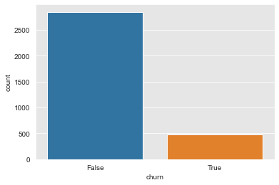
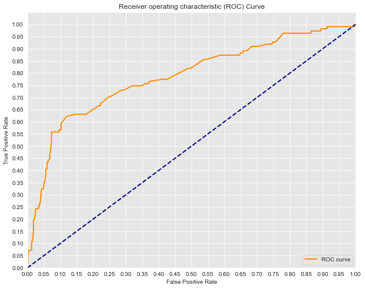
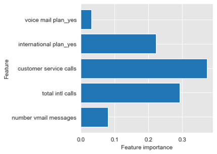

# Predicting customer turnover for Telecom Company

## Background
Customer turnover affects every company.  For this telecom company, the causes are first identified . Using machine learning identify models that provide the most accurate response for future predictions

## Business Problem
In a Perfect world, customer retention would be 100 percent. Unfortunately customer turnover is an everyday thing. First we identify causes of turnover. Then using machine learning algorithms, we can predict which would give us the most accurate predictions for future predictions

## Data
Using Telecom data set. Dataset has 3333 rows, and 17 columns.
Contains data including 
- daytime calls, minutes and pricing.
- night time calls, minutes and pricing.
- International calls, minutes, pricing
- Customer service calls
- If customer had International plan
- Customer turnover, if the customer left or still a current customer

## Methods
First evaluation using statsmodel logistic regression, to determine if variables in question have statistical significance to target variable
- Non-Necessary variables were removed.
For Logistic Regression only
- Plot the Area Under The Curve using ROC to evaluate performance of model

For KNN, Decision Trees, and Random Forests Models, and Logistic Regression
- Calculated accuracy using the confusion matrix
- Evaluated Precison, Recall, and f1 score of each model
For Random Forests only, provide feature importance to see which features played a role in customer turnover/customer retention

## Results
Looking at Odds ratio data:
- International Plan, has an odds ratio greater than one. They are 7 times more likely to leave.
- Also customers who have made customer service calls are 55% more likely to leave.
- Customers who make international calls are 8% less likely to leave, and customers who have a voicemail plan are 84% less likely to leave

For Logistic Regression, the model had an accuracy score of 0.70

For KNN, the model had an accuracy score of 0.87

For Decision Trees, the model had an accuracy score of 0.87

For Random Forests, the model had an accuracy score of 0.87

Because KNN, Decision Trees, and RandomForests, have the same accuracy. The next best deciding factor is the f1 score.

For KNN, the model had an f1 score of 0.42

For Decison Trees, the model had an f1 score of 0.42

For Random Forests, the model had an f1 score of 0.55

Plotting feature importance, using Decision Trees. customer services calls and then total international calls were top two important features, when determining customer turnover/customer retention

## Conclusions / Summary of Findings
Looking at Odds ratio, we see that International Plan, has an odds ratio greater than one. They are 7 times more likely to leave.

Also customers who have made customer service calls are 55% more likely to leave.

Plotting feature importance, using Decision Trees. customer services calls and then total international calls were top two important features for determining customer turnover / customer retention. 

Logisitic Regression has the lowest accuracy among the models tested. KNN, Decision Trees, Random Forests had best accuracy

Random Forest was tie breaker by best f1 score.

├── data : data used for modeling

├── images : images used in PPT and readme

├── README.md : project information and repository structure

├── dsc-phase-3-project-presentation.pptx : (Presentation for Stakeholders)

└── dsc-phase-3-project.ipynb (jupyter notebook used for modeling)

